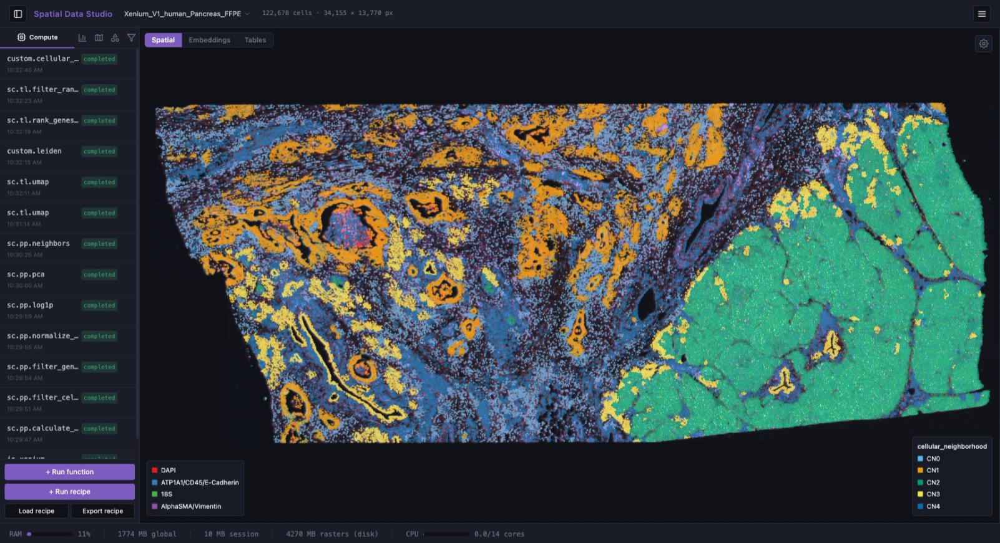
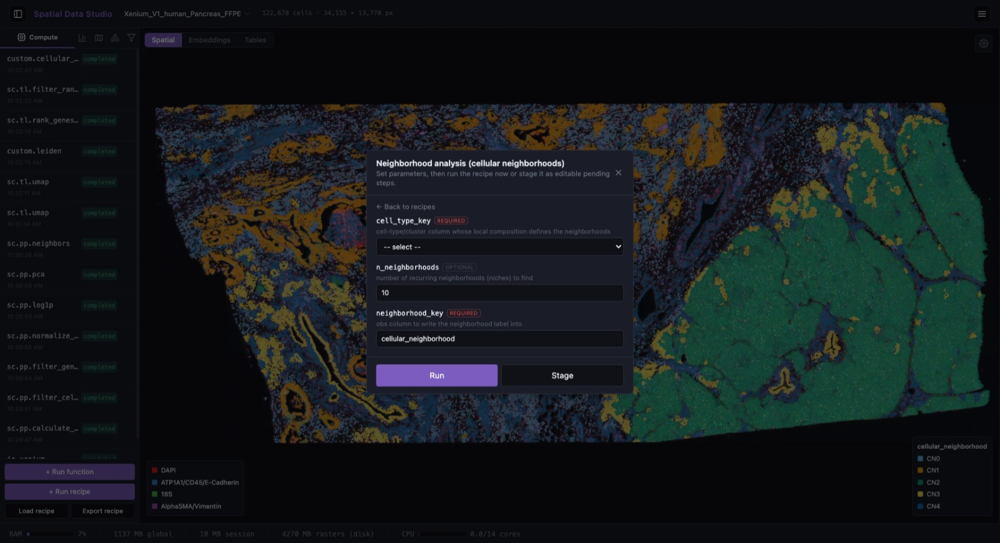
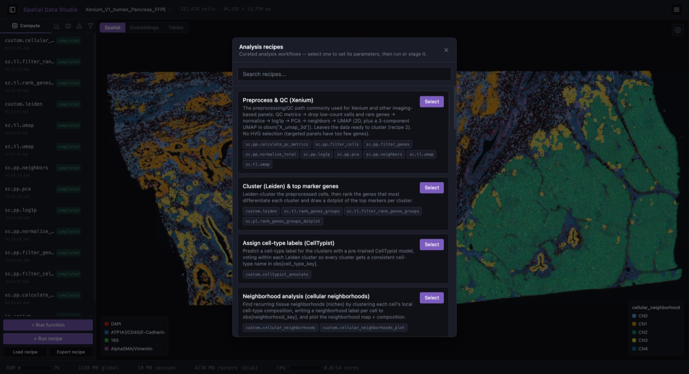
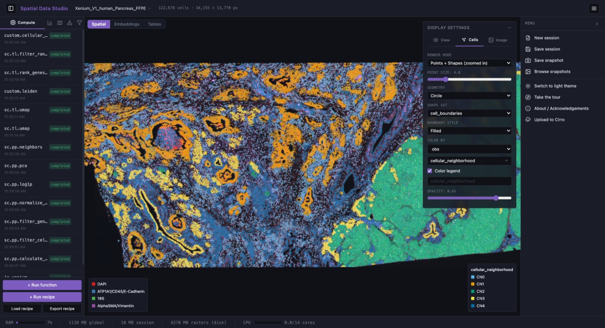
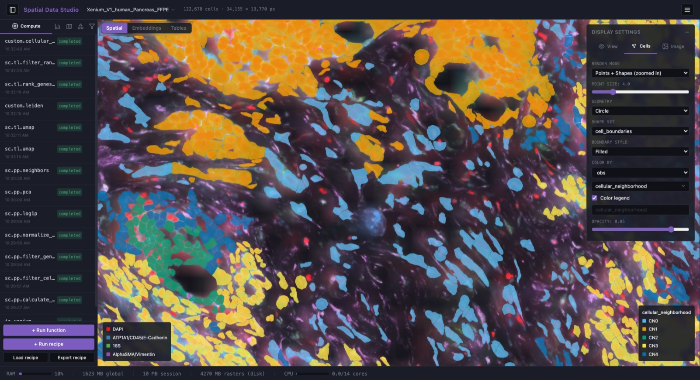

# Spatial Data Studio

**Interactive analysis and visualization for spatial omics data — in the browser,
no code required.**

Spatial Data Studio lets you open a spatial transcriptomics dataset (Xenium, Visium,
Visium HD, CosMx, MERSCOPE, or anything else [SpatialData](https://spatialdata.scverse.org/)
can read), run [`squidpy`](https://squidpy.readthedocs.io/) and
[`scanpy`](https://scanpy.readthedocs.io/) analyses on it through point-and-click
forms, and explore the result on a fast WebGL canvas that draws every cell over the
tissue image. It runs as a single local server you open in your browser.



*A whole Xenium ovarian-cancer section (~400,000 cells), colored by cellular
neighborhood. The left panel organizes the session into **Compute**, **Plots**,
**Regions**, **Annotations**, and **Subset** tabs; the **Compute** tab shown here is
the analysis history that produced this view.*

## What you can do

- **Load your data.** Point the app at a raw acquisition folder (a spatialdata-io
  reader parses it) or open an existing SpatialData `.zarr` store. Large datasets can
  take a while to read, so the reader's log streams live while it works. Datasets stay
  resident in memory for the session.
- **Run analyses without writing code.** Every `squidpy` and (curated) `scanpy`
  function appears in a searchable picker with a form generated from the function's
  own signature — QC, normalization, clustering, neighborhood enrichment, spatially
  variable genes, co-occurrence, ligand-receptor, and more. Each carries a citation
  and a link to its documentation. Data-transforming functions run from the **Compute**
  tab; plotting functions render static figures collected in a separate **Plots** tab.
- **Apply curated recipes.** Multi-step workflows (preprocess → cluster → annotate →
  neighborhood analysis) you can run in one click or stage and edit step by step.
- **Visualize interactively.** Color cells by any gene or metadata column, choose which
  tissue-image channels to display (up to 6 at once) and how they're named, colored (any
  color, not just presets), and contrast-adjusted (min/max per channel), switch between
  point and cell-boundary rendering, and view non-spatial embeddings (UMAP/PCA) in 2D or
  3D — all on the same GPU canvas.
- **Annotate.** Draw lasso regions to label cells, or draw shapes and text directly on
  the tissue. Region labels become ordinary metadata columns you can then analyze by.
  Labeling works on the embedding view too — in 3D it labels every cell visible within
  the drawn region.
- **Subset.** Lasso a region — on the tissue or an embedding — to spin off a child session
  that keeps (or removes) just those cells.
- **Save and share.** Save a checkpoint you can reopen later, save a **snapshot** — a
  high-quality figure of the current view exported as a vector PDF and/or raster PNG,
  framed and sized in a dialog with a live preview — or (optionally) upload results to
  [Cirro](https://cirro.bio/). Saved snapshots are collected in a gallery you can
  browse, download, or delete; each file embeds the provenance (view, settings, and the
  analysis steps that produced the data).

<table>
<tr>
<td width="50%"></td>
<td width="50%"></td>
</tr>
<tr>
<td><b>Run a function.</b> Each operation opens with its provenance and a form built from the function's parameters.</td>
<td><b>Apply a recipe.</b> Curated workflows run every step in order, or stage them for editing.</td>
</tr>
</table>



*Customize the display, organised into **View**, **Cells**, and **Image** icon tabs —
choose what colors the cells, how they render, how the plot is oriented (flip the
horizontal/vertical axes), the zoom level (buttons plus scroll/pinch) and its background
(light or dark), and how each tissue-image channel is colored and contrast-adjusted.
(Text and shape annotations that persist with the dataset are drawn from the left
panel's **Annotations** tab.)*



*Switch to cell-boundary rendering to draw each cell as its actual segmentation
shape rather than a point — pick the shape set (here `cell_boundaries`) and choose
whether each boundary is a filled shape or an outline (with an adjustable line
width), colored by the cell's value either way.*

## Analyses available

The gallery leads with a **guided Xenium region-analysis workflow** you run in order:
preprocess & QC → Leiden cluster & top marker genes → assign cell-type labels
(CellTypist) → neighborhood analysis (cellular neighborhoods) → cell types &
neighborhoods by region → region gene-expression differences.

Beyond that you get the full `squidpy` spatial toolkit (neighborhood enrichment,
Moran's I / Geary's C spatially variable genes, co-occurrence, Ripley's statistics,
ligand-receptor interactions), `scanpy` preprocessing and clustering, and a set of
**spatial / multi-sample methods** that scanpy and squidpy don't provide out of the
box: cellular neighborhoods, Milo differential abundance, LISI integration
diagnostics, proximity/avoidance testing, region-boundary infiltration profiles,
pseudobulk differential expression (DESeq2), and region feature differences
(Kruskal-Wallis).

## Run it

The quickest way to try it is the single Docker image:

```bash
python scripts/prepare_test_data.py     # writes test-data/visium_hne.zarr (~375 MB, needs squidpy)
docker compose up --build -d            # builds the SPA + backend into one image
open http://localhost:8080              # New Session -> /data/visium_hne.zarr
```

The compose file bind-mounts a single read-write data directory at `/data`, holding
inputs, saved checkpoints, and snapshots together. It defaults to `test-data/`;
point it at your own folder with `SDS_DATA_HOST_DIR` (env var or `.env` entry), e.g.
`SDS_DATA_HOST_DIR=/path/to/data docker compose up`. Enable the optional Cirro upload
by setting `CIRRO_BASE_URL`,
`CIRRO_CLIENT_ID`, and `CIRRO_CLIENT_SECRET` from an OAuth token in a `.env` file
(with any unset, the upload button stays hidden and the app runs normally).
Memory limits, the manual `docker run` form, and the full environment contract are in
[`docker/README.md`](docker/README.md).

To run the app from source for development instead, see
[`DEVELOPMENT.md`](DEVELOPMENT.md#local-dev-environment).

## For developers

- **[`DEVELOPMENT.md`](DEVELOPMENT.md)** — architecture, repo layout, where to make a
  change, local dev setup, tests, and the offline CLI.
- **[`DESIGN.md`](DESIGN.md)** — the full design specification and the reasoning
  behind it.
- **[`docs/CONTRACT.md`](docs/CONTRACT.md)** — the REST / SSE / Arrow API contract.
- **[`CONTRIBUTING.md`](CONTRIBUTING.md)** — add a recipe (one JSON file) or a custom
  analysis function.

> **Maintenance rule:** this README is the source of truth for **what the app does
> and how a user runs it**; [`DEVELOPMENT.md`](DEVELOPMENT.md) is the source of truth
> for the developer-facing detail. Any change that adds, removes, or alters a
> user-facing capability or the run command updates this README in the same commit
> (and refreshes a screenshot if it materially changes a pictured panel). See
> [`CLAUDE.md`](CLAUDE.md).
