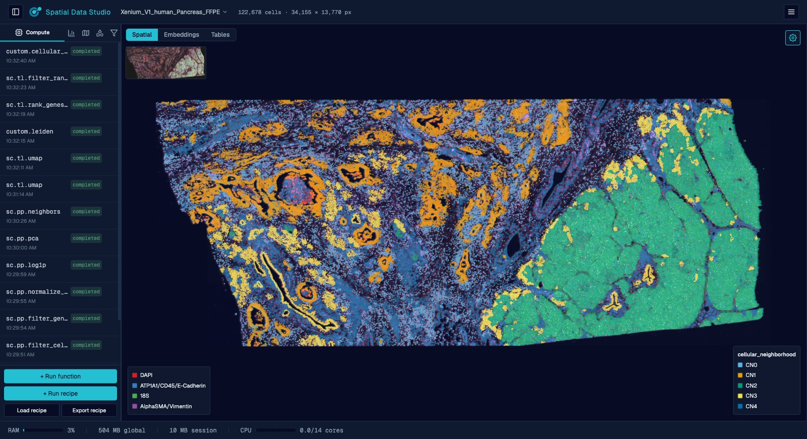
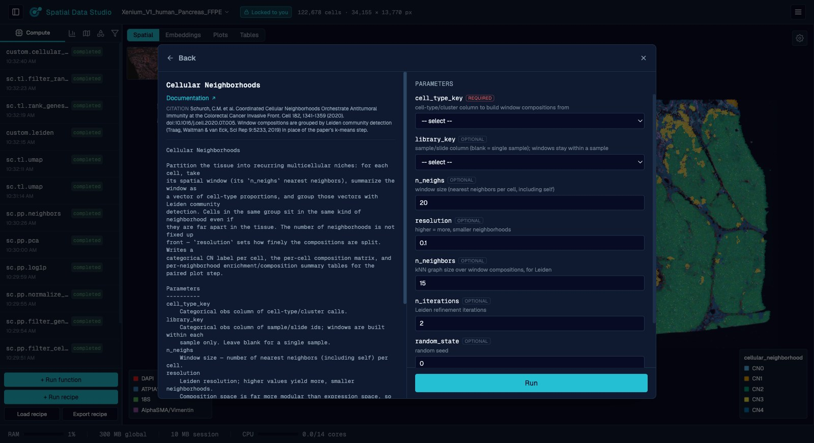
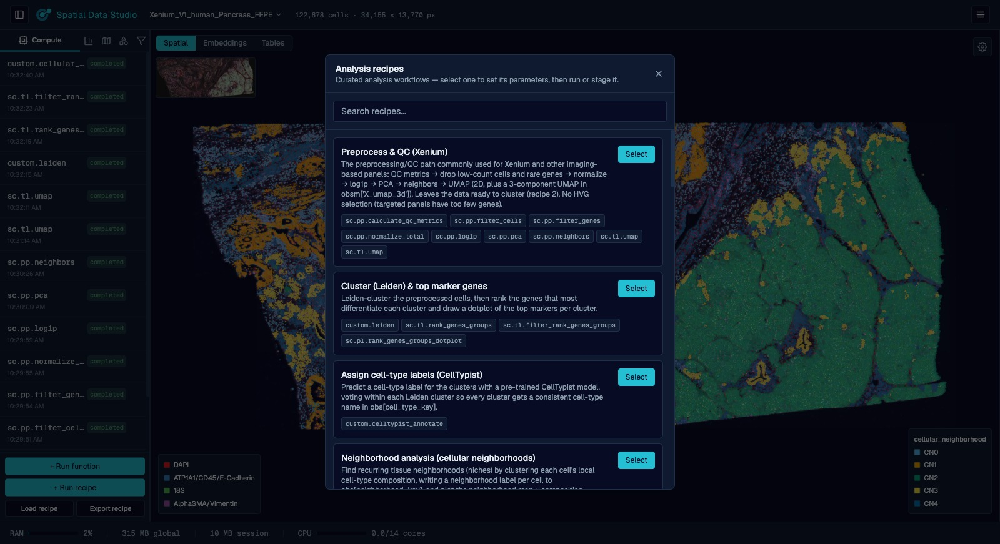
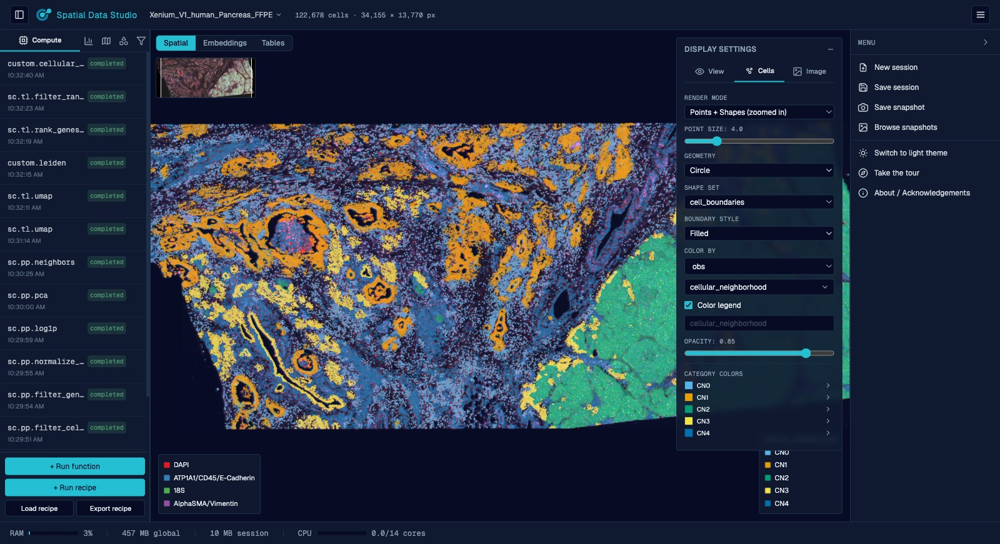
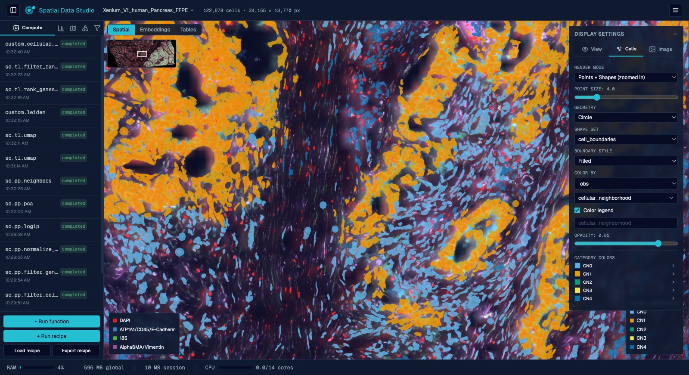

# Spatial Data Studio

**Interactive analysis and visualization for spatial omics data — in the browser,
no code required.**

Spatial Data Studio lets you open a spatial transcriptomics dataset (Xenium, Visium,
Visium HD, CosMx, MERSCOPE, or anything else [SpatialData](https://spatialdata.scverse.org/)
can read), run [`squidpy`](https://squidpy.readthedocs.io/) and
[`scanpy`](https://scanpy.readthedocs.io/) analyses on it through point-and-click
forms, and explore the result on a fast WebGL canvas that draws every cell over the
tissue image. It runs as a single local server you open in your browser.



*A whole Xenium ovarian-cancer section (~400,000 cells), colored by cellular
neighborhood. The left panel organizes the session into **Compute**, **Plots**,
**Regions**, **Annotations**, and **Subset** tabs; the **Compute** tab shown here is
the analysis history that produced this view.*

## What you can do

- **Load your data.** Point the app at a raw acquisition folder (a spatialdata-io
  reader parses it) or open an existing SpatialData `.zarr` store. Each reader input
  is its own field: a folder or file input opens a filesystem picker, and the reader's
  options (e.g. whether Xenium reads transcripts, cell boundaries, or the morphology
  image) are toggles/values — so you tailor exactly what gets loaded. Large datasets
  can take a while to read, so the reader's log streams live while it works. Datasets
  stay resident in memory for the session.
- **Run analyses without writing code.** Every `squidpy` and (curated) `scanpy`
  function appears in a searchable picker with a form generated from the function's
  own signature — QC, normalization, clustering, neighborhood enrichment, spatially
  variable genes, co-occurrence, ligand-receptor, and more. Each carries a citation
  and a link to its documentation. Data-transforming functions run from the **Compute**
  tab; plotting functions render static figures collected in a separate **Plots** tab.
- **Apply curated recipes.** Multi-step workflows (preprocess → cluster → annotate →
  neighborhood analysis) you can run in one click or stage and edit step by step.
- **Visualize interactively.** Color cells by any gene or metadata column, choose which
  tissue-image channels to display (up to 6 at once) and how they're named, colored (any
  color, not just presets), and contrast-adjusted (min/max per channel), switch between
  point and cell-boundary rendering, and view non-spatial embeddings (UMAP/PCA) in 2D or
  3D — all on the same GPU canvas. A **minimap** in the canvas' top-left corner shows the
  whole section with a box marking the part you're looking at; click or drag it to jump
  somewhere else.
- **Annotate.** Draw lasso regions to label cells, or draw shapes and text directly on
  the tissue. Region labels become ordinary metadata columns you can then analyze by.
  Applying a label recolors the view by that region set and paints the labelled cells in
  the color you picked; the draw color then advances to the next preset for the next
  group. Labeling works on the embedding view too — in 3D it labels every cell visible
  within the drawn region.
- **Subset.** Lasso a region — on the tissue or an embedding — to spin off a child session
  that keeps (or removes) just those cells.
- **Share a session safely.** Opening a session locks it to you, so a second person
  who connects can look but not change anything. A padlock next to the session name
  shows whether the session is locked to you, locked to someone else, or unlocked, and
  lists everyone currently viewing; the session list shows who holds each session's
  lock and how many people are on it. You appear under a two-word name like *gloomy
  socrates* — click the padlock to rename yourself, unlock the session so a colleague
  can take over, or take an unlocked session's lock. While someone else holds the lock
  you can still explore freely and change any display setting (color by, channels,
  zoom, render mode); those changes stay on your screen instead of going into the
  session.
- **Save and share.** Save a checkpoint you can reopen later — choosing what goes into
  the file from a checklist of the dataset's elements, each with its estimated size, so
  you can leave a multi-gigabyte tissue image out of a copy you want to send someone
  (the session on screen keeps everything either way). Save a **snapshot** — a
  high-quality figure of the current view exported as a vector PDF and/or raster PNG,
  framed and sized in a dialog with a live preview, optionally with the minimap inset
  included in the figure — or upload saved checkpoints to
  [Cirro](https://cirro.bio/). Saved snapshots are collected in a gallery you can
  browse, download, or delete; each file embeds the provenance (view, settings, and the
  analysis steps that produced the data).
- **Work with an AI assistant.** The backend speaks the
  [Model Context Protocol](https://modelcontextprotocol.io/) at `/api/mcp`, so an AI
  agent (e.g. Claude) can drive the same studio you're looking at: load data, run
  analyses and recipes, draw and *look at* plots and the tissue view (renders come
  back with a world-coordinate grid and an exact pixel→coordinate mapping), restyle
  displays, label regions of cells, subset, and save — every change appears in your
  browser live. The agent joins the same per-session edit lock you do (it shows up as
  *Claude (assistant)* on the padlock while it works, and hands control back when
  done), and connects with built-in guidance covering the studio and spatial-omics
  analysis. From this repo, `claude` picks the server up automatically via
  [`.mcp.json`](.mcp.json); from anywhere else:
  `claude mcp add --transport http spatial-data-studio http://127.0.0.1:8000/api/mcp`
  (use your deployment's own host/port for a Docker install, e.g. `:8080`; prefer
  `127.0.0.1` over `localhost` locally — the dev backend binds IPv4 only, and
  `localhost` can resolve to `::1` and reach some other process squatting the port).
  The MCP
  endpoint is unauthenticated like the rest of the API — expose the port only to
  people and processes you'd let edit your sessions.
- **Open a checkpoint without the app running.** A saved checkpoint is a single
  `.zarr.zip` the viewer can read on its own. Open the app with `?checkpoint=<url>`
  and it reads that file directly over HTTP range requests: the tissue image, the
  cells, and every display setting (color by any obs column or gene, palettes and
  per-category colors, point size and shape, channel colors and contrast, legends,
  layer visibility, pan and zoom) work exactly as they do live, with no backend and no
  server to run. It streams only what the current view needs rather than downloading
  the file — opening a 438 MB checkpoint and coloring by a gene costs under a
  megabyte. Any host that serves the file with HTTP range requests will do — put the
  built app, your `.zarr.zip` files, and a small `index.json` listing them in one
  folder and the page becomes a browsable collection you can switch between.
  The left panel opens collapsed and holds one thing: the history of the analysis
  that produced the checkpoint — expand it to see each function that was run, and
  click an entry for its parameters and timing. Anything that would act on the data
  (running an analysis, annotating, subsetting, plotting, saving) needs the live app.
  You can still export what you see as a PNG; the publication-quality PDF figure and
  cell-boundary outlines aren't available this way.
- **Share the exact view you're looking at.** In that no-backend viewer, every display
  setting you change from what the checkpoint was saved with — color by, palettes and
  per-category colors, channels and contrast, point size and shape, legends, layer
  visibility, and where you've panned and zoomed to — is kept in the page's address.
  **Copy link to this view** in the menu hands you a URL that reopens the same
  checkpoint framed and styled exactly as you left it, so a collaborator sees your view
  rather than the saved one. Only your changes travel, so the link stays short.
  You can try this without installing anything — the
  [live demos](https://cirrobio.github.io/spatial-data-studio/demo/) are the real viewer
  running in your browser against a hosted checkpoint.

<table>
<tr>
<td width="50%"></td>
<td width="50%"></td>
</tr>
<tr>
<td><b>Run a function.</b> Each operation opens with its provenance and a form built from the function's parameters.</td>
<td><b>Apply a recipe.</b> Curated workflows run every step in order, or stage them for editing.</td>
</tr>
</table>



*Customize the display, organised into **View**, **Cells**, and **Image** icon tabs —
choose what colors the cells, how they render, how the plot is oriented (flip the
horizontal/vertical axes), the zoom level (buttons plus scroll/pinch), whether the
minimap is shown, the plot's own light/dark backdrop (on the **Image** tab, set per
plot and independent of the app theme), and how each tissue-image channel is colored
and contrast-adjusted. A dataset that carries more than one image (say an H&E next to
a morphology stain) picks which one is drawn under the cells at the top of the
**Image** tab, or **None** for no image at all; each image brings its own channels.
When cells are colored by a categorical value, each group's color can be overridden
individually (and reset to the default palette) at the bottom of the **Cells** tab.
(Text and shape annotations that persist with the dataset are drawn from the left
panel's **Annotations** tab.)*



*Switch to cell-boundary rendering to draw each cell as its actual segmentation
shape rather than a point — pick the shape set (here `cell_boundaries`) and choose
whether each boundary is a filled shape or an outline (with an adjustable line
width), colored by the cell's value either way.*

## Analyses available

The gallery leads with a **guided Xenium region-analysis workflow** you run in order:
preprocess & QC → Leiden cluster & top marker genes → assign cell-type labels
(CellTypist) → neighborhood analysis (cellular neighborhoods) → cell types &
neighborhoods by region → region gene-expression differences.

Beyond that you get the full `squidpy` spatial toolkit (neighborhood enrichment,
Moran's I / Geary's C spatially variable genes, co-occurrence, Ripley's statistics,
ligand-receptor interactions), `scanpy` preprocessing and clustering, and a set of
**spatial / multi-sample methods** that scanpy and squidpy don't provide out of the
box: cellular neighborhoods, Milo differential abundance, LISI integration
diagnostics, proximity/avoidance testing, region-boundary infiltration profiles,
pseudobulk differential expression (DESeq2), and region feature differences
(Kruskal-Wallis).

## Run it

The quickest way to try it is the single Docker image:

```bash
python scripts/prepare_test_data.py     # writes test-data/visium_hne.zarr (~375 MB, needs squidpy)
docker compose up --build -d            # builds the SPA + backend into one image
open http://localhost:8080              # New Session -> /data/visium_hne.zarr
```

The compose file bind-mounts a single read-write data directory at `/data`, holding
inputs, saved checkpoints, and snapshots together. It defaults to `test-data/`;
point it at your own folder with `SDS_DATA_HOST_DIR` (env var or `.env` entry), e.g.
`SDS_DATA_HOST_DIR=/path/to/data docker compose up`. Cirro upload needs no server-side
configuration — each user signs in with their own Cirro account from the browser (see
[Upload to Cirro](#upload-to-cirro) below). Set `CIRRO_BASE_URL` in a `.env` file to
prefill a domain other than `app.cirro.bio`.
Memory limits, the manual `docker run` form, and the full environment contract are in
[`docker/README.md`](docker/README.md).

To run the app from source for development instead, see
[`DEVELOPMENT.md`](DEVELOPMENT.md#local-dev-environment).

## Upload to Cirro

You can publish saved checkpoints to [Cirro](https://cirro.bio/) from the menu in the
right-hand sidebar. Each person signs in with their own Cirro account, so several
people can use the same running app without sharing credentials.

1. **Connect to Cirro** asks for your Cirro domain (for example `app.cirro.bio`) and gives
   you a login link. Open it, sign in as you normally would, and the dialog updates
   itself when you're done — closing it won't cancel the login. Everything else about
   your account is discovered from the domain.
2. The menu entry then reads **Upload to Cirro** and shows which account you're signed
   in as. **Disconnect from Cirro** signs you out of this browser.
3. The upload dialog asks for a project, a dataset name, an optional description and
   destination folder, and which saved sessions to include. Uploading runs in the
   background — you can keep working, and the sidebar shows progress.

Alongside your checkpoints, the upload includes the viewer itself (`index.html`) and an
`index.json` listing them, so the resulting Cirro dataset opens as a browsable
collection that anyone with access can view without running this app. (Uploads made
from a development server, which has no built viewer on disk, carry the checkpoints and
`index.json` only; the dialog tells you which kind of upload you're making.)

Your Cirro sign-in lives only in the running app's memory and is dropped after 8 hours
of inactivity or when you disconnect.

## For developers

- **[`DEVELOPMENT.md`](DEVELOPMENT.md)** — architecture, repo layout, where to make a
  change, local dev setup, tests, and the offline CLI.
- **[`DESIGN.md`](DESIGN.md)** — the full design specification and the reasoning
  behind it.
- **[`docs/CONTRACT.md`](docs/CONTRACT.md)** — the REST / SSE / Arrow API contract.
- **[`CONTRIBUTING.md`](CONTRIBUTING.md)** — add a recipe (one JSON file) or a custom
  analysis function.

> **Maintenance rule:** this README is the source of truth for **what the app does
> and how a user runs it**; [`DEVELOPMENT.md`](DEVELOPMENT.md) is the source of truth
> for the developer-facing detail. Any change that adds, removes, or alters a
> user-facing capability or the run command updates this README in the same commit
> (and refreshes a screenshot if it materially changes a pictured panel). See
> [`CLAUDE.md`](CLAUDE.md).
